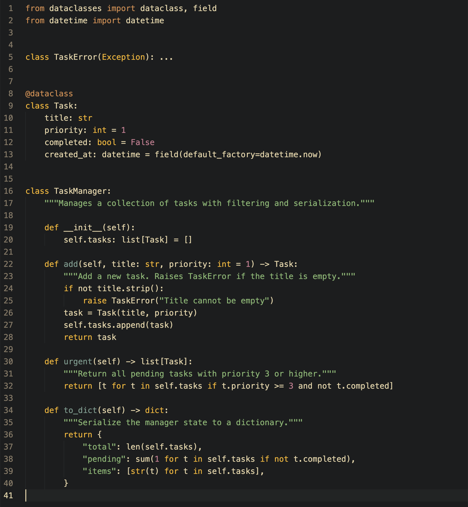
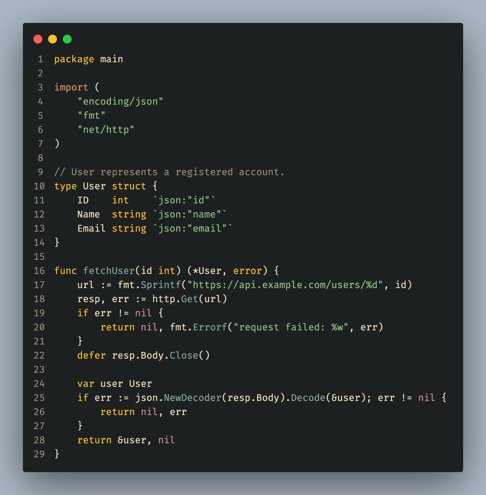
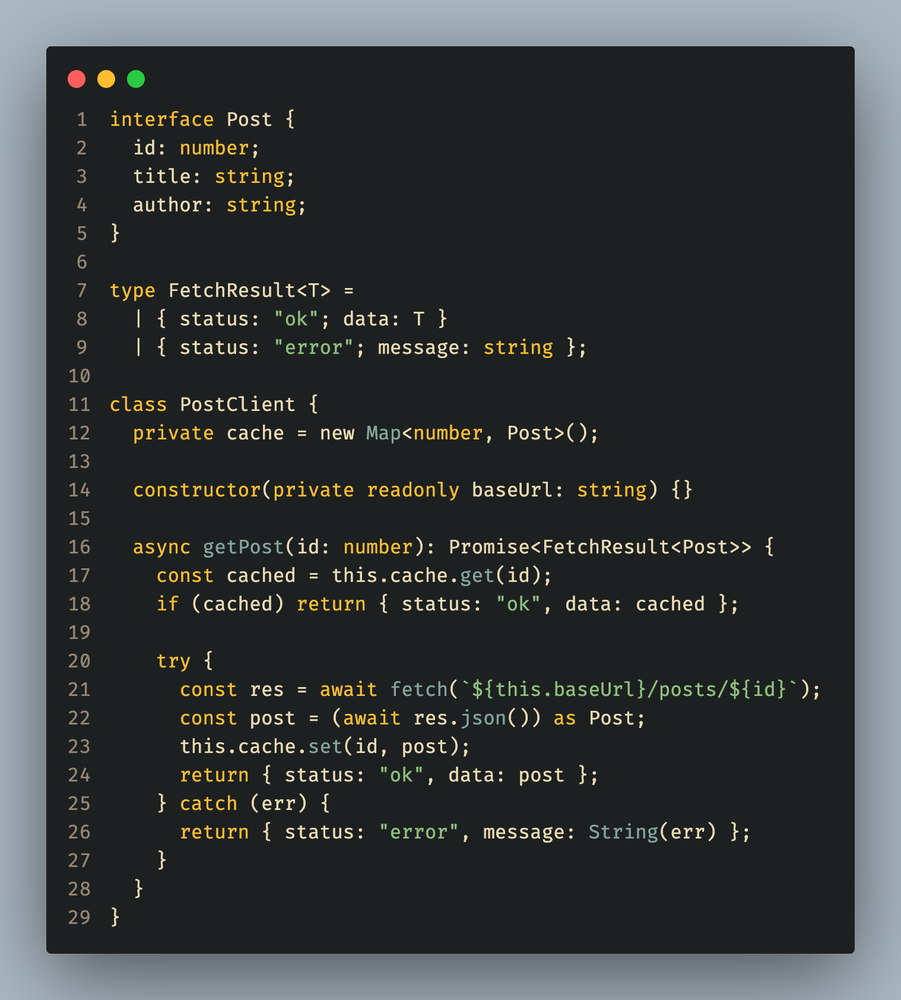

# Gruvbit for VS Code

Port of [vim-gruvbit](https://github.com/habamax/vim-gruvbit) for Visual Studio Code.

## Preview

### Python



### Go



### TypeScript



## Installation

### From Marketplace

1. Open VS Code
2. Go to Extensions (`Ctrl+Shift+X` / `Cmd+Shift+X`)
3. Search for `Gruvbit`
4. Click **Install**
5. `Ctrl+K Ctrl+T` / `Cmd+K Cmd+T` → select **Gruvbit**

### From VSIX

1. Download the `.vsix` file from [Releases](https://github.com/Maksim-Burtsev/gruvbit-vscode/releases)
2. Run: `code --install-extension gruvbit-*.vsix`

### From Source

```sh
git clone https://github.com/Maksim-Burtsev/gruvbit-vscode
cd gruvbit-vscode
npm install -g @vscode/vsce
vsce package
code --install-extension gruvbit-*.vsix
```

## Credits

- **Maxim Kim** ([@habamax](https://github.com/habamax)) — author of [vim-gruvbit](https://github.com/habamax/vim-gruvbit)
- **Pavel Pertsev** ([@morhetz](https://github.com/morhetz)) — author of [gruvbox](https://github.com/morhetz/gruvbox), the colorscheme gruvbit is based on

## License

MIT
